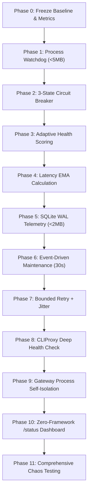

# LỘ TRÌNH NÂNG CẤP LAR-OS GATEWAY v3.0 ➔ v3.5 (TƯ VẤN TỪ CHATGPT)

> **Mục tiêu**: Nâng cấp từ **9.1 / 10** lên **~9.6 / 10** mà không làm tăng tài nguyên hệ thống.  
> **Ràng buộc vàng**: **RAM < 45MB**, **CPU Idle ~0%**, **Zero-Infrastructure** (Không Docker, không Prometheus, không Grafana, không Redis, không Celery).  
> **Triết lý cốt lõi**: *"Một Gateway process + một Go proxy + một SQLite file + zero infrastructure."*

---

## 1. Ngân Sách Tài Nguyên (Resource Budget Cứng)

| Thành phần | Công nghệ | RAM Budget | CPU Idle |
| :--- | :--- | :---: | :---: |
| **LAR-OS Gateway Core** | Python `asyncio` / Stdlib | `< 15 MB` | `~0%` |
| **Health & Scoring Engine** | Nhúng trực tiếp trong Gateway | `< 5 MB` | `~0%` |
| **SQLite Telemetry & State** | SQLite C-driver (`WAL mode`) | `< 2 MB` | `0%` |
| **Tier-4 CLIProxyAPI Daemon** | Go static binary (compiled) | `< 25 MB` | `~0%` |
| **TỔNG TOÀN HỆ THỐNG** | **Single-box Local AI Control Plane** | **`< 45 MB`** | **`~0%`** |

> [!IMPORTANT]
> **Danh sách ĐEN (Tuyệt đối KHÔNG sử dụng - Architectural Overkill)**:
> ❌ Docker / Kubernetes  
> ❌ Redis / RabbitMQ / Celery  
> ❌ Prometheus / Grafana / OpenTelemetry Collector  
> ❌ Node.js / React / Next.js Monitoring Dashboard  
> ❌ ElasticSearch / Logstash  

---

## 2. Các Open-Source Repositories Uy Tín & Siêu Nhẹ Được Cite

1. **[`router-for-me/CLIProxyAPI`](https://github.com/router-for-me/CLIProxyAPI)**:
   - *Vai trò*: Core binary Tier-4 failover. Single binary Go (<25MB), hỗ trợ chạy Windows Service / Linux Daemon.
2. **[`cenkalti/backoff`](https://github.com/cenkalti/backoff)**:
   - *Vai trò*: Thuật toán Exponential Backoff + Jitter kinh điển. Có thể copy ~30-50 dòng logic trực tiếp vào Python mà không cần install dependency.
3. **[`sethvargo/go-retry`](https://github.com/sethvargo/go-retry)**:
   - *Vai trò*: Bộ retry siêu nhẹ và nhanh cho Go nếu cần viết thêm sidecar Go.
4. **[`shirou/gopsutil`](https://github.com/shirou/gopsutil)**:
   - *Vai trò*: Thư viện thu thập metric OS nếu cần, tuy nhiên khuyến nghị dùng trực tiếp Python built-in `subprocess` hoặc Windows native API để tiết kiệm thêm.

---

## 3. Lộ Trình Thực Thi 11 Giai Đoạn (Step-by-Step Roadmap)



### Chi tiết từng giai đoạn:

### **Phase 0 — Đóng băng baseline (Baseline Freeze)**
- Đo lường trước khi code: RAM idle, CPU idle, Latency P50/P95/P99, Tỷ lệ 429, Tỷ lệ fallback sang Tier-4.
- Không tối ưu những gì chưa đo được.

### **Phase 1 — Watchdog siêu nhẹ (Tiny Process Watchdog)**
- Thay vì cài supervisor cồng kềnh, Gateway dùng một luồng `subprocess` kiểm tra `poll()` định kỳ mỗi 5–10s.
- Nếu process chết: Khởi động lại với **Exponential Backoff** (tránh vòng lặp restart liên tục).

### **Phase 2 — Chuẩn hóa Circuit Breaker (3-State Pattern)**
- Xây dựng state machine: `CLOSED` (bình thường) $\rightarrow$ `OPEN` (ngắt kết nối) $\rightarrow$ `HALF_OPEN` (thử nghiệm khôi phục).
- **Phân loại lỗi thông minh**:
  - `HTTP 429`: Chuyển `OPEN`, cooldown $60s$.
  - `Timeout`: Chuyển `OPEN`, cooldown $30–60s$.
  - `HTTP 5xx`: Chuyển `OPEN`, cooldown $15–30s$.
  - `HTTP 4xx Auth`: `OPEN` dài hạn, cảnh báo console.
  - `Success`: Reset failures = 0, chuyển `CLOSED`.

### **Phase 3 — Chấm điểm sức khỏe động (Adaptive Health Score)**
- Thay thế cơ chế `if-else` cứng nhắc bằng hàm tính điểm từ $0 \rightarrow 100$:
  $$\text{Score} = 100 - \min(\text{failures} \times 15, 45) - \min(\frac{\text{Latency}_{\text{EMA}}}{100}, 30) - (\text{Timeout} \times 20)$$
- Router luôn ưu tiên gửi request tới endpoint có điểm cao nhất.

### **Phase 4 — Latency EMA (Exponential Moving Average)**
- Tính toán latency trung bình theo thời gian thực mà không cần lưu mảng dữ liệu:
  $$\text{EMA}_{\text{new}} = \alpha \times \text{Latency}_{\text{current}} + (1 - \alpha) \times \text{EMA}_{\text{old}} \quad (\alpha = 0.2)$$
- Không tốn RAM, không cần database engine.

### **Phase 5 — SQLite WAL Telemetry**
- Lưu log và state vào SQLite với chế độ:
  ```sql
  PRAGMA journal_mode=WAL;
  PRAGMA synchronous=NORMAL;
  ```
- Retention policy cứng: Tự động xóa sự kiện cũ hơn 7 ngày hoặc vượt quá 100,000 dòng. File DB luôn $< 2\text{MB}$.

### **Phase 6 — Event-Driven Health Engine (Zero Idle CPU)**
- Không dùng thread polling liên tục làm nóng CPU.
- Health score được cập nhật **ngay khi có request hoàn tất** (*Event-Driven*).
- Chỉ duy nhất một background task nhẹ chạy mỗi **30 giây** để dọn dẹp cooldown đã hết hạn.

### **Phase 7 — Bounded Retry & Jitter (Chống Retry Storm)**
- Thêm độ trễ ngẫu nhiên vào cooldown để tránh 5 tài khoản cùng thức giấc một lúc gây nghẽn:
  $$\text{Cooldown} = 60s + \text{random}(0, 15s)$$
- Giới hạn tối đa 1 lần chuyển route trên mỗi request của client.

### **Phase 8 — Deep Health Check cho Tier-4**
- Phân biệt rõ: **Process Alive** (PID tồn tại) $\neq$ **Upstream Healthy** (Token OAuth Google còn hiệu lực).
- Kiểm tra liveness bằng một lightweight ping định kỳ.

### **Phase 9 — Cô lập ranh giới lỗi (Failure Isolation)**
- Nếu Tier-3 (Neon) chết $\rightarrow$ chỉ đánh dấu Tier-3 offline, Gateway và Tier-4 vẫn phục vụ bình thường.
- Tuyệt đối không để lỗi ở một tầng làm crash toàn bộ Gateway.

### **Phase 10 — Zero-Framework Dashboard (`/status`)**
- Endpoint `GET /status` trả về một trang HTML thuần **5–10 KB** (không React, không JS framework).
- Hiển thị trực quan trạng thái 4 Tiers, số request, tỷ lệ fallback và latency P95.
- Endpoint `GET /metrics` trả về plain-text key-value.

### **Phase 11 — Chaos Testing (Thử Thách Độ Bền Cực Hạn)**
- Cố tình giả lập các tình huống sập nguồn:
  1. Kill ngẫu nhiên tài khoản Gemini 1 $\rightarrow$ 5.
  2. Kill tiến trình `cli-proxy-api.exe`.
  3. Xóa file OAuth token.
  4. Rớt mạng Wi-Fi / Kill Cloudflare Tunnel.
  5. Bơm lỗi 429 và 500 đồng loạt.
- Đảm bảo **Bất biến hệ thống (System Invariant)**: *Nếu còn ít nhất 1 đường sống $\rightarrow$ request phải thành công; nếu tất cả đều chết $\rightarrow$ trả về thông báo lỗi chuẩn xác ngay lập tức, không bao giờ bị treo (hang) tiến trình.*
